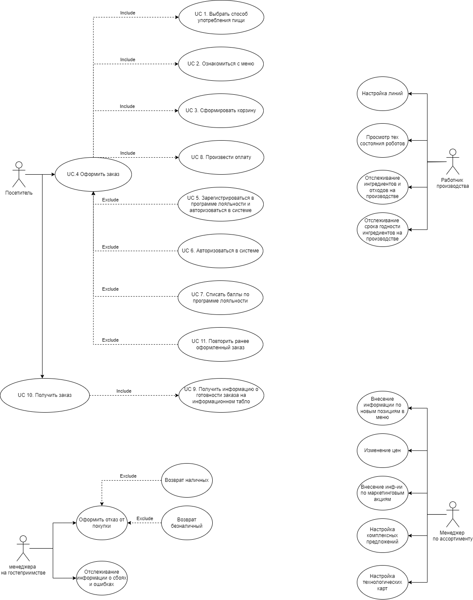

# 5. Требования к системе
## 5.1 Требования к системе в целом
### 5.1.1 Производительность
NFPER1 Система должна обслуживать до 5000 пользователей в день. Период пиковой активности с 11:00 до 17:00 по местному времени.

NFPER2 Все страницы мобильного приложения, должны полностью загружаться не более чем за 4 секунды после запроса их по интернет-подключению со скоростью 20 Мбит/сек.

NFPER3 Система должна выводить пользователю сообщение о подтверждении в среднем за 3 секунды и не более чем через 6 секунд после того, как пользователь отослал информацию системе.

NFPER4 Система должна обеспечивать пропускную цепочку 500 заказов в час на одной линии.

NFPER5 Сисетма должна быть укомплентована 4мя линиями конвеера:
- Холодный цех - сборка сендвичей, напитков и десертов; 
- Горячий цех - приготовление горячих блюд; 
- Цех сборки и подготовка к выдачи;
- Резервная 
на каждой линии 2 робота

### 5.1.2 Безопасность
NFSEC1 Система должна предусматривать аутентификацию пользователей в системе по номеру телефона и SMS или Push сообщению.

NFSEC2 Пользователи должны обязательно оплатить заказ до начала приготовления заказа.

NFSEC3 Система должна позволять авторизованным пользователям просматривать только заказы, размещенные ими лично, но не других пользоватей.

### 5.1.3 Надежность
NFROB1 Вероятность возникновения критической ошибки должна составлять не более 10% в течение месяца.

NFROB2 Если соединение между пользователем и системой разрывается до того, как заказ подтвержден, система должна позволять пользователю восстановить незавершенный заказ и продолжить работу.

NFROB3 База данных у каждой подсистемы самостоятельная, база данных у пунктов приема заказов централизованная.

### 5.1.4 Совместимость
NFCOM1 Мобильное приложение должно быть совместимо с ОС Android 5.0 или выше и iOS 10 или выше.

NFCOM2 Веб-приложение должно быть соместимо с браузерами, работающими на движках: Blink; Gecko; WebKit.

NFCOM3 Сисетма должна обеспечивать интеграцию со складом и бухгалтерией.

NFCOM4 Аналитика в приложении должна производиться с помощью сторонних сервисов.

### 5.1.5 Доступность
NFAVL1 Система должна быть доступна 98% времени, за исключением времени планового обслуживания(калибровка оборудования).

NFAVL2 Допустимое время простоя в сутки не более 30 минут.

### 5.1.7 Особенности хранения данных
NFDT1 Данные о сроках заказа должны храниться 365 дней с момента получения заказа клиентом.

NFDT2 Cрок хранения архивов - 3 года с последующем удалением.

NFDT3 Бекапы базы данных системы должны осуществляться раз в сутки. 

### 5.1.8 Концептуальная целостность
NFARC1 Система должна соответствовать архитектурному стилю REST.

NFARC2 Используемый стек технологий Java.

### 5.1.9 Поддерживаемость
NFSUP1 Необходимо логировать действия пользователей в системе. Просмотр данных логов должен осуществляться через графический интерфейс.

NFSUP2 Система должна обеспечивать мониторинг производительности с использованием графического интерфейса.

## 5.2 Требования к функциям (задачам), выполняемым системой
### 5.2.1 UseCase диаграмма
Основные функции системы представлены в виде UseCase диаграммы.

[DrawIO](UseCase.drawio)

[Holst](https://app.holst.so/share/b/32e618be-aed5-4f67-b37a-62b4513ff9ea)
## 5.2.2 Описание UseCase, реализуемых в рамках MVP

Название |UC-1: Выбрать способ употребления пищи 
| ------------- | ------------- |  
Краткое описание | Выбор способа употребления пищи в приложении
Субъекты | 1. Пользователь 
    2. Система