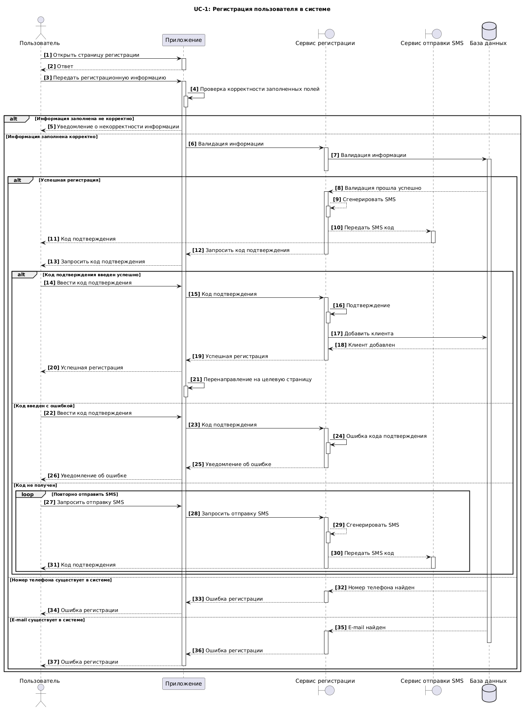
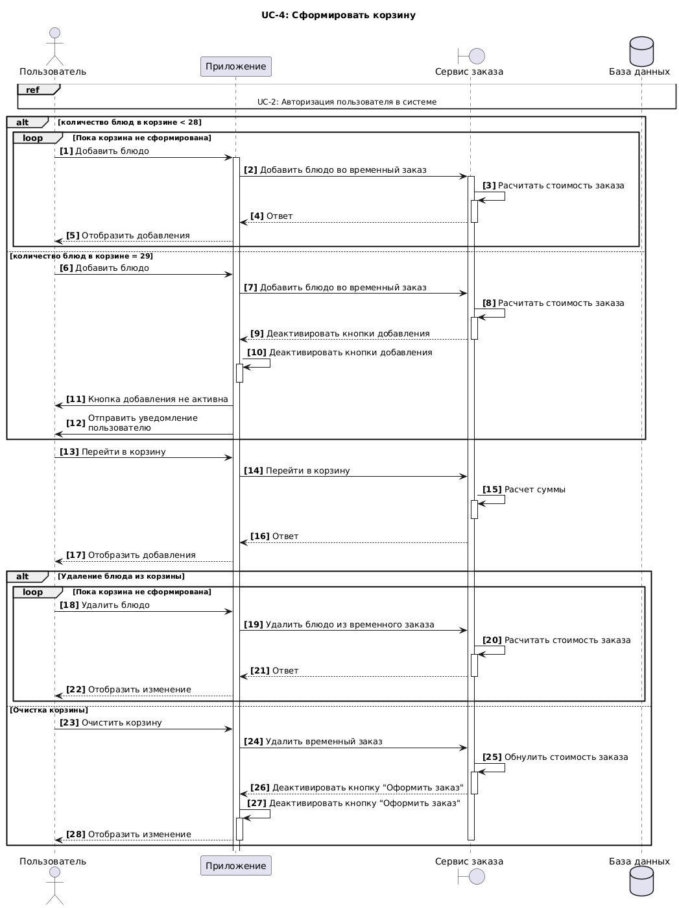
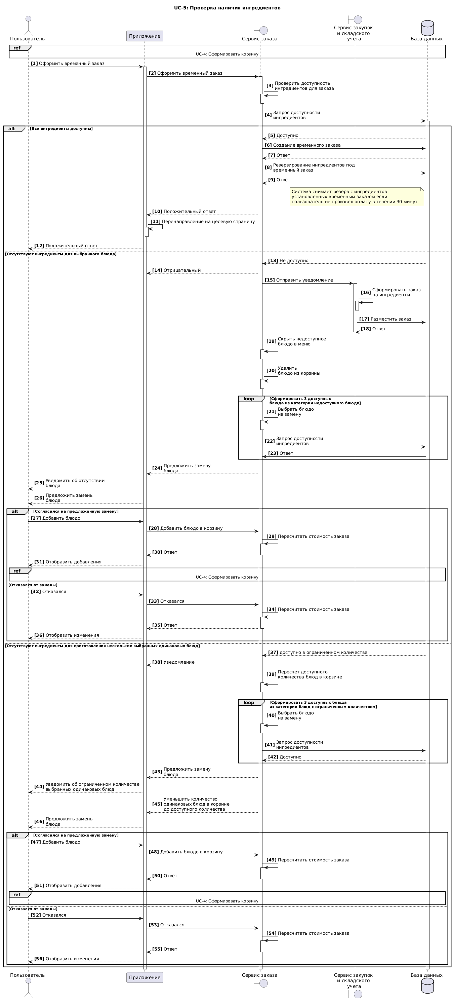

# 5. Требования к системе
## 5.1 Требования к системе в целом
### 5.1.1 Производительность
NFPER1 Система должна обслуживать до 5000 пользователей в день. Период пиковой активности с 11:00 до 17:00 по местному времени.

NFPER2 Все страницы мобильного приложения, должны полностью загружаться не более чем за 4 секунды после запроса их по интернет-подключению со скоростью 20 Мбит/сек.

NFPER3 Система должна выводить пользователю сообщение о подтверждении в среднем за 3 секунды и не более чем через 6 секунд после того, как пользователь отослал информацию системе.

NFPER4 Система должна обеспечивать пропускную цепочку 500 заказов в час на одной линии.

NFPER5 Система должна быть укомплектована 4мя линиями конвеера:
- Холодный цех - сборка сендвичей, напитков и десертов; 
- Горячий цех - приготовление горячих блюд; 
- Цех сборки и подготовка к выдачи;
- Резервная 
на каждой линии 2 робота

### 5.1.2 Безопасность
NFSEC1 Система должна предусматривать аутентификацию пользователей в системе по номеру телефона и SMS или Push сообщению.

NFSEC2 Пользователи должны обязательно оплатить заказ до начала приготовления заказа.

NFSEC3 Система должна позволять авторизованным пользователям просматривать только заказы, размещенные ими лично, но не других пользователей.

### 5.1.3 Надежность
NFROB1 Вероятность возникновения критической ошибки должна составлять не более 10% в течение месяца.

NFROB2 Если соединение между пользователем и системой разрывается до того, как заказ подтвержден, система должна позволять пользователю восстановить незавершенный заказ и продолжить работу.

NFROB3 База данных у каждой подсистемы самостоятельная, база данных у пунктов приема заказов централизованная.

### 5.1.4 Совместимость
NFCOM1 Мобильное приложение должно быть совместимо с ОС Android 5.0 или выше и iOS 10 или выше.

NFCOM2 Веб-приложение должно быть совместимо с браузерами, работающими на движках: Blink; Gecko; WebKit.

NFCOM3 Сисетма должна обеспечивать интеграцию со складом и бухгалтерией.

NFCOM4 Аналитика в приложении должна производиться с помощью сторонних сервисов.

### 5.1.5 Доступность
NFAVL1 Система должна быть доступна 98% времени, за исключением времени планового обслуживания(калибровка оборудования).

NFAVL2 Допустимое время простоя в сутки не более 30 минут.

### 5.1.7 Особенности хранения данных
NFDT1 Данные о сроках заказа должны храниться 365 дней с момента получения заказа клиентом.

NFDT2 Cрок хранения архивов - 3 года с последующем удалением.

NFDT3 Бекапы базы данных системы должны осуществляться раз в сутки. 

### 5.1.8 Концептуальная целостность
NFARC1 Система должна соответствовать архитектурному стилю REST.

NFARC2 Используемый стек технологий Java.

### 5.1.9 Поддерживаемость
NFSUP1 Необходимо логировать действия пользователей в системе. Просмотр данных логов должен осуществляться через графический интерфейс.

NFSUP2 Система должна обеспечивать мониторинг производительности с использованием графического интерфейса.

## 5.2 Требования к функциям (задачам), выполняемым системой
### 5.2.1 UseCase диаграмма
Основные функции системы представлены в виде UseCase диаграммы.

[ViewerDiagrams](https://viewer.diagrams.net/?tags=%7B%7D&lightbox=1&highlight=0000ff&edit=_blank&layers=1&nav=1&title=UseCase.drawio&dark=auto#Uhttps%3A%2F%2Fdrive.google.com%2Fuc%3Fid%3D1gGc2D9302firTckheYWKjclgMj5nHlrN%26export%3Ddownload)   
[PLANTUML](5_UML/UseCase.wsd)

### 5.2.2 Описание UseCase, реализуемых в рамках MVP

#### 5.2.2.1 Зарегистрироваться в системе

Название |UC-1: Зарегистрироваться в системе
| ------------- | ------------- |  
Краткое описание | Регистрация пользователя в мобильном приложении с целью последующего оформления заказа
Участники | 1. Пользователь
Предусловие | Пользователь зашел в приложение
Основной сценарий |1. Пользователь нажал на кнопку N1   2. Система открыла страницу регистрации в приложении   3. Пользователь заполнил все обязательные поля и нажал кнопку N2   4. Система проверила, что пользователь заполнил все обязательные поля   5. Система проверила, что введенный номер телефона ранее не использовался при регистрации   6. Система проверила, что E-mail ранее не использовался при регистрации   7. Система проверила, что пароли одинаковые   8. Система отобразила страницу подтверждения регистрации по СМС   9. Пользователь ввел полученный код из СМС   10. Система проверила правильность введенного кода из СМС   11. Система открыла страницу с выбором категорий меню.Конец сценария.
Альтернативный сценарий | AF1-3: Авторизация вместо регистрации.   3.1. Пользователь нажал кнопку N20   3.2. Система отобразила страницу выбора авторизации или регистрации. Конец сценария.   AF1-4:Информация заполнена некорректно.   4.1.Система вывела сообщение M1. Некорректно заполненная информация выделена красным цветом.     4.2.  Пользователь нажал кнопку N21    4.3. Переход к п.3 основного сценария. Конец сценария.   AF1-5:  Номер телефона уже существует в системе.   5.1. Система вывела сообщение M2.Некорректно заполненная информация выделена красным цветом.     5.2.  Пользователь нажал кнопку N21    5.3. Переход к п.1 альтернативного сценария AF1-2. Конец сценария.   AF1-6: E-mail уже существует в системе.   6.1. Система вывела сообщение M3. Некорректно заполненная информация выделена красным цветом.     6.2.  Пользователь нажал кнопку N21    6.3. Пользователь ввел новый E-mail и нажал кнопку N2   6.4. Переход к п.6 основного сценария. Конец сценария.   AF1-7:  Информация заполнена некорректно.   7.1. Система вывела сообщение M4.Некорректно заполненная информация выделена красным цветом.    7.2.  Пользователь нажал кнопку N21    7.3. Пользователь ввел в поля "Пароль" и "Повторить пароль" одинаковые значения и нажал кнопку N2   7.4. Переход к п.7 основного сценария. Конец сценария.    AF1-8: Корректировка данных на страницу регистрации в приложении    8.1.  Пользователь нажал кнопку N20   8.2. Система открыла страницу регистрации в приложении.Конец сценария.   AF1-9: Повторный запрос СМС   9.1.  Пользователь нажал кнопку N3   9.2. Переход к п.9 основного сценария. Конец сценария.   AF1-10: Информация из СМС введена некорректно    10.1. Система вывела сообщение M5   10.2. Пользователь нажал кнопку N21    10.3. Пользователь ввел правильный код из СМС и нажал кнопку N2   10.4. Переход к п.10 основного сценария. Конец сценария.  
Наименования элементов пользовательского интерфейса| N1: "Зарегестрироваться"   N2: "Зарегестрироваться"   N3: "Повторно отправить СМС"   N20: "Назад"   N21: "OK"   M1: "Пользователь не заполнил все обязательные поля"   M2: "Введенный номер телефона уже зарегистрирован"   M3: "Введенный E-mail уже зарегистрирован "   M4: "Введенные пароли отличаются"   M5: "Введенный код из СМС не правильный"
| Диаграмма |    [PLANTUML](5_UML/UC_1_Registration.wsd)

#### 5.2.2.2 Авторизоваться в системе

Название |UC-2: Авторизоваться в системе
| ------------- | ------------- |  
Краткое описание | Авторизация пользователя в мобильном приложении с целью последующего оформления заказа
Участники | 1. Пользователь 
Предусловие | 1. Пользователь зашел в приложение   2. Пользователь зарегестрирован в системе [Перейти к UC-1](#5221-Зарегистрироваться-в-системе) 
Основной сценарий | 1. Пользователь нажал на кнопку 4   2. Система открыла страницу авторизации в приложении   3. Пользователь заполнил номер телефона   4. Пользователь ввел пароль   5. Пользователь нажал кнопку N5   6. Система проверила указанный номер телефона и пароль   7. Система открыла страницу с выбором категорий меню. Конец сценария.
Альтернативный сценарий |AF2-3:Восстановление пароля   3.1.Пользователь нажал на кнопку N6   3.2. Система вывела диалоговое окно для ввода E-mail, указанного при регистрации   3.3.Пользователь ввел E-mail и нажал кнопку N7   3.4.Система отправила новый пароль на указанный E-mail  3.5. Переход к п.4 основного сценария. Конец сценария.   AF2-4: Использование E-mail для авторизации   4.1. Пользователь ввел E-mail   4.2. Переход к п.4 основного сценария. Конец сценария.   AF2-5:Информация введена некорректно   5.1. Система вывела сообщение M6   5.2. Переход к п.3 основного сценария. Конец сценария.  
Наименования элементов пользовательского интерфейса| N4: "Авторизоваться"   N5: "Войти"   N6: “Восстановить пароль”   N7: “Отправить”   M6: "Введен не правильный логин/пароль"
| Диаграмма |    [PLANTUML](5_UML/UC_2_Autentification.wsd)

#### 5.2.2.3 Ознакомится с меню

Название |UC-3: Ознакомится с меню
| ------------- | ------------- |  
Краткое описание | Просмотр категорий меню и блюд входящих в эту категорию 
Участники | 1. Пользователь
Предусловие | 1. Пользователь зашел в приложение   2. Пользователь авторизован в системе [Перейти к UC-2](#5222-Авторизоваться-в-системе) 
Основной сценарий | 1. Пользователь нажал на кнопку N8   2. Система открыла страницу с блюдами выбранной категории   3. Пользователь в левой третей части экрана выбирал категорию блюд нажав кнопку N9   4. В правой части экрана в области выбора блюд в зависимости от выбранной категории, система отобразила блюда категории. Конец сценария.
Альтернативный сценарий| AF3-3: Альтернативный вариант просмотра меню   3.1. Пользователь нажал на кнопку N20   3.2  Система открыла страницу выбора категорий меню   3.3  Переход к п.1 основного сценария. Конец сценария.
Наименования элементов пользовательского интерфейса|N8: "Категория меню"   N9: "Категория меню"   N20: "Назад" .
Диаграмма|

#### 5.2.2.4 Сформировать корзину

Название |UC-4. Сформировать корзину
| ------------- | ------------- |  
Краткое описание | Выбор блюд пользователем для последующей покупки 
Участники | 1. Пользователь 
Предусловия | 1. Пользователь зашел в приложение   2. Пользователь авторизован в системе [Перейти к UC-2](#5222-Авторизоваться-в-системе) 
Постусловия | 1. Заказ в производство поступает только после выполнения оплаты и назначения номера заказа.
Основной сценарий | 1. Пользователь нажал на кнопку N10   2. Система добавила выбранное блюдо в корзину, подсветила суммарное количество добавленных блюд над кнопкой N11 3. Система  рассчитала итоговую стоимость   4. Пользователь выполнил необходимое количество повторений п.1-п.3   5.  Пользователь нажал на кнопку N11 и открыл страницу корзины   6.Система открыла страницу корзины   7. Система отобразила добавленные блюда   8. Система отобразила количество добавленных блюд   9. Система рассчитала итоговую стоимость заказа. Конец сценария.    
Альтернативный сценарий| AF4-4a: Без просмотра корзины   4a.1. Пользователь выполнил п.1-п.4 основного сценария. Конец сценария.   AF4-4b: Выбор максимального количества блюд   4b.1. Пользователь выполнил п.1-п.4 основного сценария 99 раз   4b.2. Система деактивировала кнопки N10. Конец сценария.   AF4-10a: Изменение количества блюд   10a.1 Пользователь выполнил п.1-п.9 основного сценария   10a.2 Пользователь изменил количество блюд кнопкой N12 или N13   10a.3 Система отобразила изменение количества блюда   10a.4 Система отобразила изменение количества блюда   10a.5 Система пересчитала итоговую стоимость заказа Конец сценария.    AF4-10b: Выбор максимального количества блюд   10b.1 Пользователь выполнил п.1-п.9 основного сценария   10b.2 Пользователь нажал на кнопку N12 99 раз   10b.3 Система деактивировала кнопку N12. Конец сценария.    AF4-10c: Удаление всех блюд из корзины   10c.1 Пользователь выполнил п.1-п.9 основного сценария   10c.2 Пользователь нажал на кнопку N14   10c.3 Система удалила все блюда из корзины   10c.4 Система обнулила итог. Конец сценария.     
Наименования элементов пользовательского интерфейса|N9: "Категория меню"   N10:"Блюдо"   N11:"Корзина"    N12:"+"    N13:"-"    N14:"Очистить корзину"   N20: "Назад".
| Диаграмма |     [PLANTUML](5_UML/UC_4_CreateBasket.wsd)

#### 5.2.2.5 Проверить наличие ингредиентов на производстве

Название |UC-5: Проверить наличие ингредиентов на производстве
| ------------- | ------------- |  
Краткое описание | Проверка наличия ингредиентов на производстве в ходе оформления заказа
Участники | 1. Пользователь   
Предусловия | 1. Пользователь зашел в приложение   2. Пользователь сформировал корзину [Перейти к UC-4](#5224-Сформировать-корзину)
Основной сценарий | 1. Пользователь нажал на кнопку N15 или N18   2. Система подтвердила наличие ингредиентов на складе   3. Система открыла страницу выбора способа употребления пищи. Конец сценария.
Альтернативный сценарий| AF5-2a: Отсутствуют ингредиенты для выбранного блюда   2a.1 Система уведомила об отсутствии ингредиентов на складе   2a.2 Система предложила замену отсутствующего блюда   2a.3 Пользователь нажал на кнопку N10   2a.4 Система добавила выбранное блюдо в корзину   2a.5 Система удалила блюдо с отсутствующими ингредиентами   2a.6 Переход к п.6 основного сценария UC-4 [Перейти к UC-4](#5224-Сформировать-корзину). Конец сценария.   AF5-2b: Отсутствуют ингредиенты для выбранного блюда   2b.1 Система уведомила об отсутствии ингредиентов на складе   2b.2 Система предложила замену отсутствующего блюда   2b.3 Пользователь нажал на кнопку N20   2b.4 Система удалила блюдо с отсутствующими ингредиентами   2b.5 Переход к п.6 основного сценария UC-4 [Перейти к UC-4](#5224-Сформировать-корзину). Конец сценария.  
Наименования элементов пользовательского интерфейса|N10:"Блюдо"   N15: "Оформить заказ"   N18: "Оформить заказ"   N20: "Назад".
| Диаграмма |    [PLANTUML](5_UML/UC_5_CheckIngredients.wsd)

#### 5.2.2.6 Выбрать способ употребления пищи

Название |UC-6: Выбрать способ употребления пищи 
| ------------- | ------------- |  
Краткое описание | Выбор способа употребления пищи в приложении
Участники | 1. Пользователь  
Предусловия | 1. Пользователь зашел в приложение   2. Пользователь сформировал корзину [Перейти к UC-4](#5224-Сформировать-корзину)   3.Пользователь на странице выбора способа употребления пищи
Постусловия | 1. Заказ в производство поступает только после выполнения оплаты и назначения номера заказа.
Основной сценарий | 1. Пользователь нажал на кнопку N16    2. Система добавила в заказ способ употребления пищи   3. Система открыла страницу времени приготовления блюд. Конец сценария   
Альтернативный сценарий| AF6-1a: Употребление пищи в ресторане   1a.1 Пользователь нажал на кнопку N17   1a.2  Система добавила в заказ способ употребления пищи   1a.3 Система открыла страницу выбора времени приготовления блюд. Конец сценария    AF6-1b: Корректировка наполнения корзины   1b.1 Пользователь нажал на кнопку N20   1b.2 Система открыла корзину. Конец сценария    
Наименования элементов пользовательского интерфейса|N16: "с собой"   N17: "в зале"  N20: "Назад".
Диаграмма|

#### 5.2.2.7 Произвести оплату

Название |UC-7: Произвести оплату картой
| ------------- | ------------- |  
Краткое описание | Оплата оформленного заказа картой
Участники | 1. Пользователь 
Предусловия | 1. Пользователь зашел в приложение   2. Пользователь на странице оплаты заказа
Постусловия | 1. Заказ в производство поступает только после выполнения оплаты и назначения номера заказа.
Основной сценарий | 1. Пользователь нажал на кнопку N27    2. Система вывела страницу оплаты платежной системы   3. Пользователь ввел номер карты, имя держателя карты, срок действия карты и CVV   4. Пользователь нажал кнопку N28   5. Система получила подтверждение оплаты   6. Система отправила электронный чек об оплате на E-mail   7. Система открыла страницу подтверждения оплаты   8. Система отобразила номер заказа, адрес ресторана, время готовности заказа. Конец сценария    
Альтернативный сценарий| AF7-1: Корректировка времени приготовления заказа   1.1 Пользователь нажал на кнопку N20    1.2 Система открыла страницу выбора времени приготовления блюд [Перейти к UC-8](#5228-Уточнить-время-приготовления-заказа). Конец сценария.   AF7-5a: Ошибка оплаты   5a.1 Система отправила уведомление M7   5a.2 Система вернула пользователя на страницу оплаты заказа. Конец сценария.   AF7-5b: Недостаточно денежных средств   5b.1 Система отправила уведомление M8   5b.2 Система вернула пользователя на страницу оплаты заказа. Конец сценария.   AF7-5с Информация заполнена некорректно.   5с.1.Система вывела сообщение M9. Некорректно заполненная информация выделена красным цветом.     5с.2  Пользователь нажал кнопку N21    5с.3 Переход к п.3 основного сценария. Конец сценария.  
Наименования элементов пользовательского интерфейса| N20: "Назад"    N21: "OK"   N27: "Оплатить заказ"   N28: "Оплатить"    M7: "Ошибка оплаты заказа, попробуйте позднее"   M8: "Недостаточно денежных средств на карте"   M9: "Информация заполнена некорректно"
Диаграмма|

#### 5.2.2.8 Уточнить время приготовления заказа

Название |UC-8: Уточнить время приготовления заказа
| ------------- | ------------- |  
Краткое описание | Уточнение в заказе времени к которому необходимо приготовить блюда
Предусловия | 1. Пользователь зашел в приложение   2. Пользователь сформировал корзину [Перейти к UC-4](#5224-Сформировать-корзину)   3. Пользователь открыл страницу времени приготовления блюд
Постусловия | 1. Заказ в производство поступает только после выполнения оплаты и назначения номера заказа.
Основной сценарий | 1. Пользователь нажал на кнопку выпадающего меню N22   2. Система отобразила даты от Сегодня до плюс Неделя    3. Пользователь выбрал дату    4. Пользователь нажал на кнопку выпадающего меню N23   5. Система отобразила часы    6. Пользователь выбрал время в часах   7. Пользователь нажал на кнопку выпадающего меню N24   8. Система отобразила минуты    9. Пользователь выбрал время в минутах   7. Пользователь нажал на кнопку N19.   8. Система открыла страницу оплаты заказа. Конец сценария   
Альтернативный сценарий| AF8-1a: Заказ на ближайшее время   1a.1 Пользователь нажал на кнопку N19   1a.2 Система открыла страницу оплаты заказа. Конец сценария    AF8-1b: Корректировка способа употребления пищи   1a.1 Пользователь нажал на кнопку N20   1a.2 Система открыла страницу выбора способа употребления пищи [Перейти к UC-6](#5226-Выбрать-способ-употребления-пищи). Конец сценария.  
Наименования элементов пользовательского интерфейса|N19: "Оформить заказ"   N20: "Назад"   N22: "Дата"   N23: "Час"   N24: "Мин" 
Диаграмма|

#### 5.2.2.9 Получить информацию о готовности заказа на информационном табло

Название |UC-11: Получить информацию о готовности заказа на информационном табло
| ------------- | ------------- |  
Краткое описание | Получение информации о готовности заказа на информационном табло
Участники | 1. Пользователь   2. Менеджер на гостеприимстве
Предусловия | 1. Пользователь оформил заказ, произвел оплату и получил номер заказа   2. Пользователь находится в Ресторане
Основной сценарий | 1. Пользователь на информационном табло нашел заказ в колонке K1. Конец сценария.
Альтернативный сценарий|AF11-1a: Заказ еще не готов   1a-1. Пользователь на информационном табло нашел заказ в колонке K2.   1a-2. Пользователь дождался готовности заказа, перехода в колонку K1.Конец сценария.    AF11-1b: Заказ отсутствует на информационном табло   1b-1. Пользователь не нашел заказ в колонках K1 и K2 на информационном табло   1b-2. Пользователь обратился к Менеджеру на гостеприимстве. Конец сценария.
Наименования элементов пользовательского интерфейса|K1: "Готовятся"   K2: "Готовы"
Диаграмма|

### 5.2.3 Описание UseCase, реализуемых в рамках первого релиза 
#### 5.2.3.1 Начислить баллы по программе лояльности

Название |UC-9: Начислить баллы по программе лояльности
| ------------- | ------------- |  
Краткое описание | Получить баллы по программе лояльности после оформления и оплаты заказа 
Участники | 1. Пользователь   2. Менеджер на гостеприимстве
Предусловия | 1. Пользователь оформил заказ, произвел оплату картой [Перейти к UC-7](#5227-Произвести-оплату)
Основной сценарий | 1. Система начислила клиенту баллы по программе лояльности. Конец сценария. 
Альтернативный сценарий|AF9-1: Менеджер на гостеприимстве отменил заказ клиента   1. Основной сценарий п. 1   2. Менеджер на гостеприимстве отменил заказ по требованию клиента   3. Система списала начисленные клиенту баллы по программе лояльности. Конец сценария. 

#### 5.2.3.2 Списать баллы по программе лояльности

Название |UC-10: Списать баллы по программе лояльности
| ------------- | ------------- |  
Краткое описание | Получить скидку при оформлении заказа путем списания баллов по программе лояльности
Участники | 1. Пользователь
Предусловия |  1. Пользователь зашел в приложение   2. Пользователь сформировал корзину [Перейти к UC-4](#5224-Сформировать-корзину)   3. Пользователь выбрал способ употребления пищи [Перейти к UC-6](#5226-Выбрать-способ-употребления-пищи)   4.Пользователь уточнил время приготовления блюд [Перейти к UC-8](#5228-Уточнить-время-приготовления-заказа)  5.Пользователь на странице оплаты заказа
Основной сценарий | 1. Пользователь нажал на кнопку N26    2. Система рассчитала допустимое количество баллов для списания   3. Система проверила наличие баллов    4. Система уменьшила количество баллов в интерфейсе Приложения   5. Система добавила строчку T1 на странице оплаты заказа   6. Система добавила строчку T2 на странице оплаты заказа   7. Пользователь нажал кнопку N27, переход к п.1 основного сценария UC-7 [Перейти к UC-7](#5227-Произвести-оплату)  8. Система списала баллы с бонусного счета пользователя. Конец сценария. 
Альтернативный сценарий|AF10-3: Отсутствие бонусных баллов у пользователя   3.1 Система обнаружила отсутствие баллов у пользователя   3.2 Система уведомила пользователя M10. Конец сценария     AF10-7: Отмена примененного списания бонусных баллов   7.1 Пользователь нажал кнопку N20   7.2 Система открыла страницу времени приготовления блюд.   7.3 Система отменила нажатие пользователем на кнопки N26 и все примененные действия описанные в пп.1-6 основного сценария. Конец сценария. 
Наименования элементов пользовательского интерфейса| N20: "Назад"   N26: "Списать баллы"   N27: "Оплатить заказ"   T1:"Списано баллов"   T2:"Итого с учетом скидки"   M10: "Отсутствуют бонусные баллы"
Диаграмма|

#### 5.2.3.3  Получить информацию о готовности заказа по СМС

Название |UC 12: Получить информацию о готовности заказа по СМС
| ------------- | ------------- |  
Краткое описание | 
Участники | 1. Пользователь
Предусловия | 1. Пользователь зашел в приложение   2. Пользователь оформил заказ, произвел оплату, получил номер заказа, с производства получено уведомление о готовности заказа.
Основной сценарий | 1. Пользователь получил СМС о готовности заказа . Конец сценария.  

### 5.2.4 Исключения:

Связь с сервером прервана
1.	Система на мобильном устройстве пользователя отображает сообщение, что дальнейшая работа невозможна из-за потери связи с сервером

### 5.2.5 Дополнительная функции (связанные use case):

Закрытие мобильного приложения
1.	Система сохраняет сформированный неоплаченную корзину заказа на мобильном устройстве при закрытии приложения