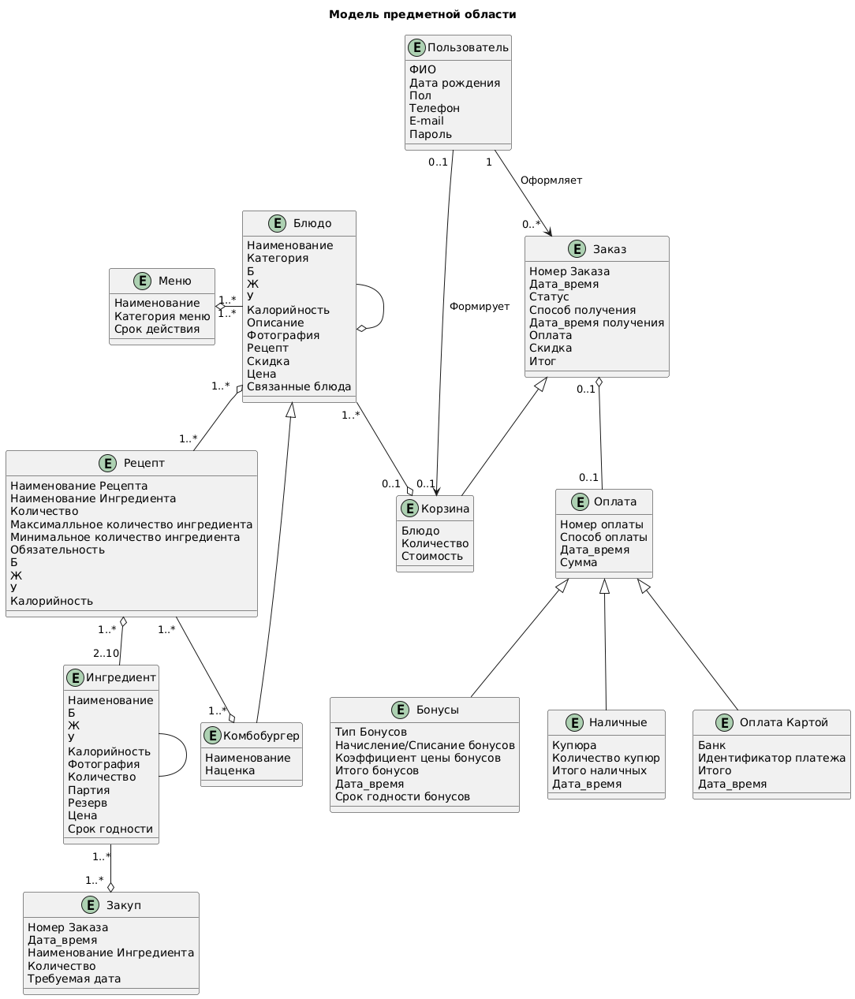
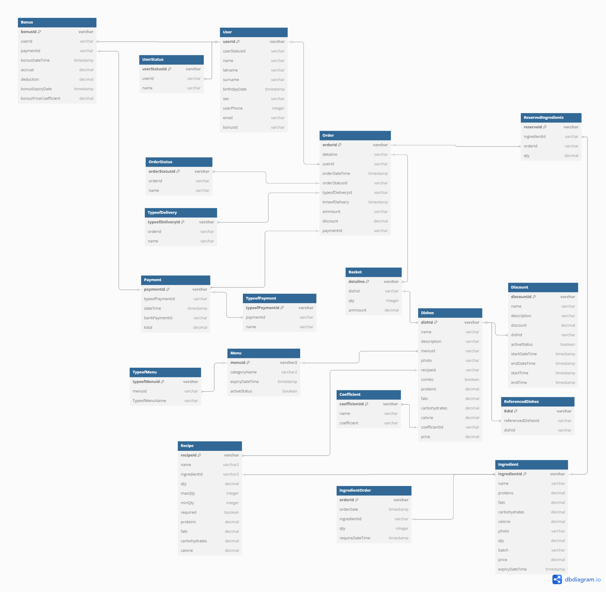

# 6. Информационная модель
## 6.1 Модель предметной области
В рамках MVP проекта были выделены основные сущности с атрибутами и определены связи между ними.

Базовыми сущностями являются:

Пользователь 
Заказ 
Блюдо 
Ингредиент 

[ClassDiagram](6_UML/ClassDiagram.wsd)

## 6.2 Модель данных
[Postgresql](6_UML/ERD.sql)
