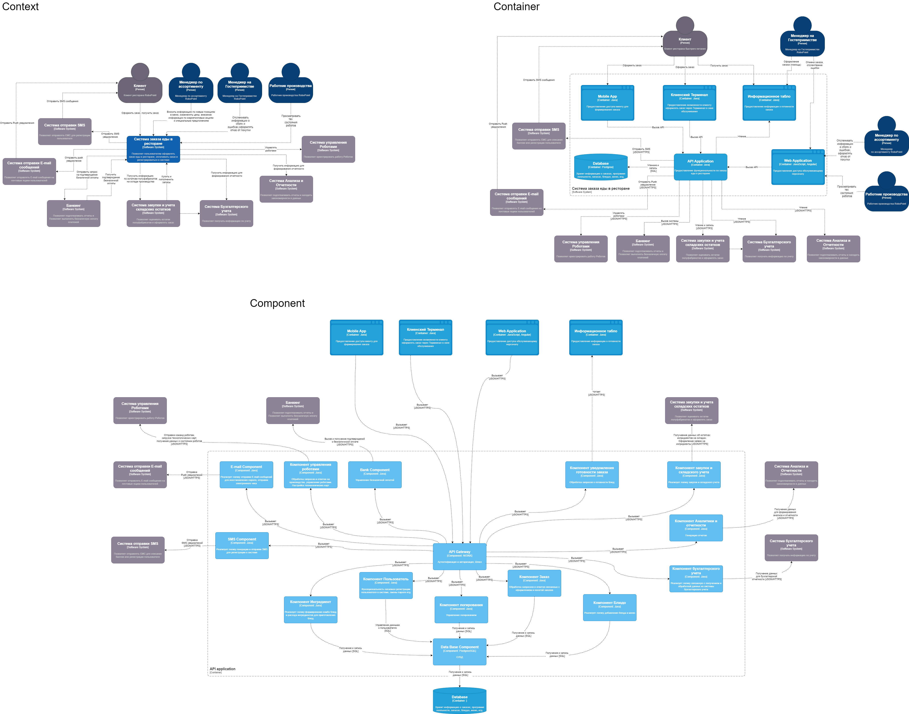

# 7. Компонентная архитектура

## 7.1 Обоснование выбора архитектурного стиля
Микросервисная архитектура является эффективным подходом для разработки приложений, которые должны масштабироваться и быть гибкими в изменении. В случае приложения для  заказа еды в ресторане, микросервисная архитектура может предоставить следующие преимущества:

Гибкость: Микросервисы могут быть разработаны и развернуты независимо друг от друга, что позволяет быстро вносить изменения в приложение без необходимости перезапуска всего приложения.

Масштабируемость: Микросервисы могут быть масштабированы отдельно друг от друга, что позволяет легко управлять нагрузкой на приложение и обеспечивать высокую доступность.

Устойчивость: Если один из микросервисов не работает, остальные микросервисы могут продолжать работу, что обеспечивает устойчивость приложения в целом.

Легкость разработки: Разработчики могут работать над отдельными микросервисами, что упрощает процесс разработки и тестирования.

Легкость внедрения новых функций: Новые функции могут быть добавлены в виде новых микросервисов, что позволяет быстро внедрять новые возможности в приложение.

## 7.2 Диаграмма компонентов
На диаграмме представлены компоненты микросервисной архитектуры системы и интеграции между данными компонентами. 

[ViewerDiagrams](https://viewer.diagrams.net/?tags=%7B%7D&lightbox=1&highlight=0000ff&edit=_blank&layers=1&nav=1&title=%D0%A14.drawio&dark=auto#Uhttps%3A%2F%2Fdrive.google.com%2Fuc%3Fid%3D183QMieam4U3z-u8zH36BOPIHtT-7DTFB%26export%3Ddownload) 
 

## 7.3 Описание компонентов